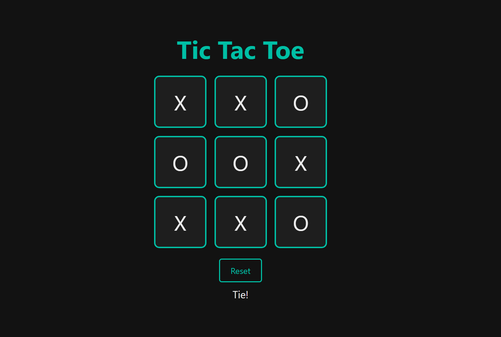

# 🟢 Tic-Tac-Toe React App

A **dark-themed Tic-Tac-Toe** game built with **React (JSX only)**.  
Enjoy classic X vs O gameplay with a modern dark UI and glowing winning effect.

---

## 🖥 Demo



---

## ⚙️ Features

- Track current player’s turn
- Automatically detect the winner
- Highlight winning combination with teal glow
- Detect tie games
- Reset game button
- Responsive and clean design

---

## 🛠 Technologies Used

- **React** (JSX only)
- **JavaScript ES6+**
- **CSS3** for dark theme and glowing winning tiles


## 🚀 How to Run Locally

1. Clone the repository:

```bash
git clone https://github.com/yourusername/tic-tac-toe-react-app.git
cd tic-tac-toe-react-app
```

2. Install dependencies:

```bash
npm install
```

3. Start the development Server

```bash
npm start
```

4. Open http://localhost:5173/ or whatever in your browser.
